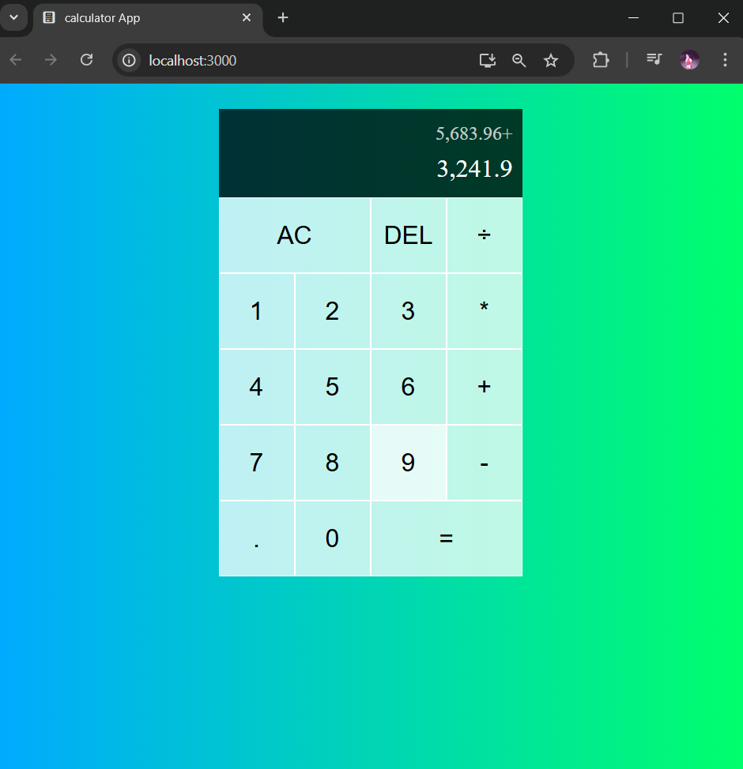

# 📱 calculator-app-react

A simple, responsive calculator built using **React**. Perform basic arithmetic operations with a clean and intuitive UI. This project is perfect for practicing state management and component structuring in React.

---

## ✨ Features

- Perform addition, subtraction, multiplication, and division
- Responsive design for desktop and mobile
- Clean and minimal UI
- Easy-to-understand component structure

---

## 🚀 Getting Started

Follow these instructions to set up and run the calculator app locally.

### 📦 Prerequisites

- Node.js (v14 or later)
- npm or yarn

### 🛠️ Installation

1. **Clone the repository:**

   ```bash
   git clone https://github.com/Venumadhavmule/calculator-app-react
   cd calculator-app-react
   ```

2. **Install dependencies:**

   ```bash
   npm install
   ```

3. **Start the development server:**

   ```bash
   npm start
   ```

4. Open your browser and go to `http://localhost:3000` to see the app in action.

---

## 🖼️ Output Screenshot

Below is a screenshot of the running calculator:



---
## 👨‍💻 Author

Made with ❤️ by [Venumadhava Mule](https://github.com/Venumadhavmule)
